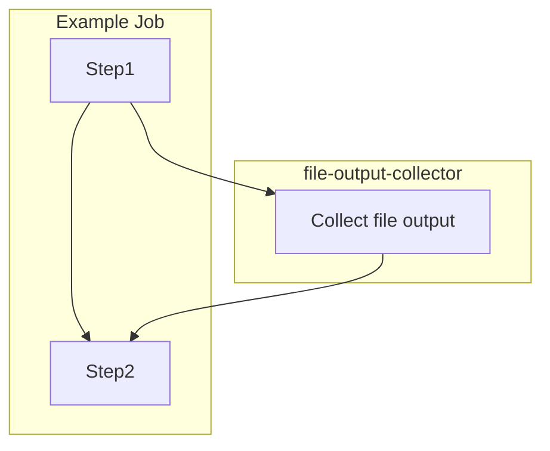

# File Output Collector GitHub Action

Reusable GitHub Action to collect file output to use in other steps.  This is a relatively minimal action but is used to reduce duplication in other actions.

## Components

This is a Composite GitHub Action with all logic contained in the `action.yml` file.

### Inputs

| Name | Description | Default |
| ---- | ----------- | ------- |
| `file` | **REQUIRED** Path to file to collect output from | `''` |
| `fail_on_missing` | Fail if file is missing | `false` |

### Outputs

| Name | Description |
| ---- | ----------- |
| `output` | Output from file |

## Usage

This action is called as a `step` during a job to collect the output of a file.  The output is then available to other steps in the job.

Example Flow:



Example Workflow:

```yaml
- name: Checkout code
  uses: actions/checkout@v3
- name: Collect file output
  id: step1
  uses: collinmcneese/file-output-collector/.github/actions/collect-file-output
  with:
    file: 'path/to/file'
- name: Use file output
  id: step2
  run: |
    echo "${{ steps.step1.outputs.output }}"
```
